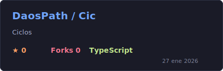
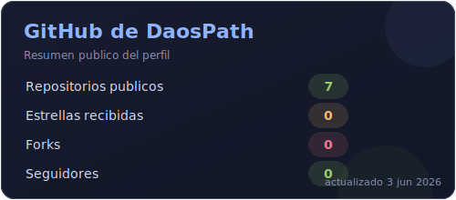
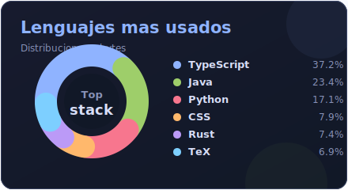

<h1 align="center">🌞 Hola, soy <strong>DaosPath</strong></h1>

  Desarrollador web enfocado en experiencias simples, útiles y humanas.
  Mi camino mezcla código abierto, herramientas personales y comunidad.

  
  

---

### 🧭 Sobre mí

- Desarrollo interfaces web con **HTML**, **CSS**, **JavaScript**, **TypeScript** y **React**.
- Me interesan las herramientas que ayudan a ordenar vida, mente, energía y recursos.
- Formo parte de **Hijos del Sol**, explorando tecnología al servicio del crecimiento personal y comunitario.
- Estoy profundizando en **TypeScript**, **accesibilidad**, **PWA** y aplicaciones con datos locales.

---

### 🛠️ Stack

  
  
  
  
  
  
  

---

### 🌟 Proyecto destacado

  

**Cic** es una aplicación **React + Vite** para registrar el ciclo menstrual y obtener insights asistidos por IA, con enfoque en privacidad: datos locales vía IndexedDB, modo discreto y PWA lista para usarse offline.

---

### 📊 Estadísticas

  
  

---

### 🤝 Conectar

- Abierto a colaborar en proyectos web centrados en **cuidado personal**, **organización** y **espiritualidad práctica**.
- También me interesan productos pequeños, claros y sostenibles que sirvan a comunidades reales.

> Que el código sirva a la luz, no al ruido.
