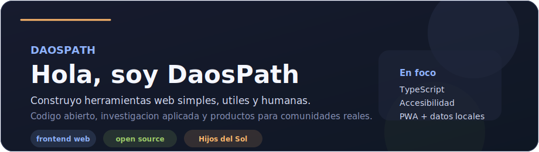
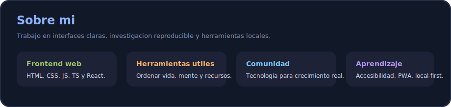
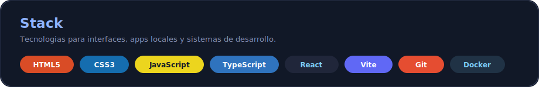
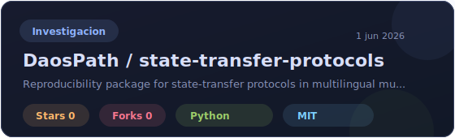
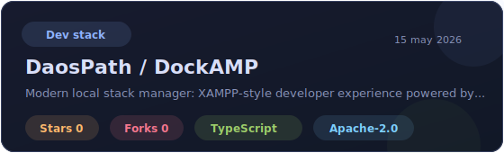
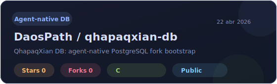
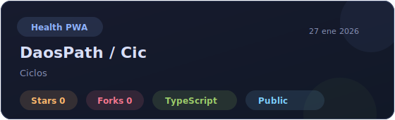
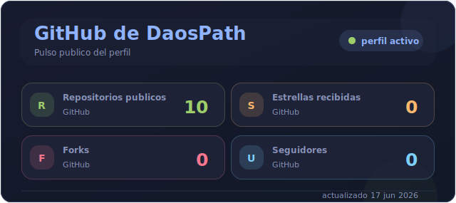
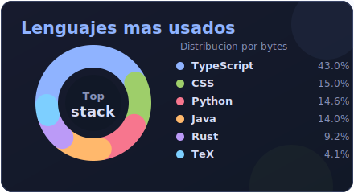

  

  
  

---

### 🧭 Sobre mí

  

---

### 🛠️ Stack

  

---

### 🌟 Proyectos destacados

  
  
   
  
  

- **state-transfer-protocols**: investigación reproducible sobre handoff multilingüe entre agentes.
- **DockAMP**: stack local moderno tipo XAMPP con Docker, Tauri, React, TypeScript y Rust.
- **qhapaqxian-db**: fork experimental de PostgreSQL orientado a flujos agent-native.
- **Cic**: PWA privada para registro del ciclo, datos locales e insights asistidos por IA.

---

### 📊 Estadísticas

  
  

---

### 🤝 Conectar

- Abierto a colaborar en proyectos web centrados en **cuidado personal**, **organización** y **espiritualidad práctica**.
- También me interesan productos pequeños, claros y sostenibles que sirvan a comunidades reales.

> Que el código sirva a la luz, no al ruido.
